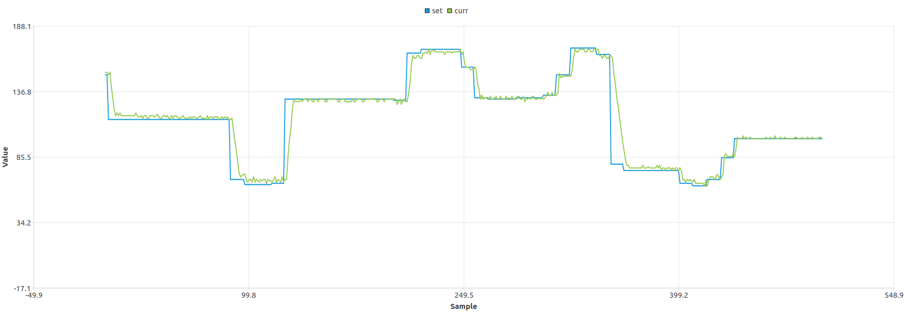

# Motor Control Library for STM32F407

A comprehensive DC motor control library with PID speed regulation and differential drive support for STM32F407 microcontroller.

## 📋 Architecture Overview

The library consists of several coordinated classes that provide high-level motor control:

```
┌─────────────────┐
│  DiffDrive API  │  ← Differential drive control
└────────┬────────┘
         │
    ┌────┴─────┬──────────┬─────────────┐
    │          │          │             │
    ▼          ▼          ▼             ▼
┌────────┐ ┌──────┐ ┌───────┐ ┌──────────┐
│Encoder │ │ PID  │ │Driver │ │STM32 LL  │
│Class   │ │ Ctrl │ │(L298) │ │Drivers   │
└────────┘ └──────┘ └───────┘ └──────────┘
```

## 🔧 Classes Overview

### 1️⃣ **Encoder Class**
- **Purpose**: Reads quadrature encoder signals and computes motion parameters
- **Key Methods**:
  - `getRPM()`: Get current rotational speed
  - `getAngle()`: Get accumulated angle
  - `getAngularVelocity()`: Get angular velocity in rad/s
  - `update()`: Update encoder readings

### 2️⃣ **PIDController Class**
- **Purpose**: Implements PID control algorithm with anti-windup
- **Features**:
  - Proportional, Integral, Derivative terms
  - Integral windup prevention
  - Output saturation limits
- **Key Methods**:
  - `compute(error, dt)`: Calculate control output
  - `reset()`: Reset internal state

### 3️⃣ **MotorDriver Class**
- **Purpose**: Controls L298N H-bridge motor driver
- **Features**:
  - PWM speed control
  - Direction control (forward/backward/stop)
  - **Direction flip support** for motors wired in reverse
  - Speed range: -100% to +100%
- **Key Methods**:
  - `setSpeed(float speed)`: Set motor speed (-100 to 100)
  - `setDirection(MotionDirection dir)`: Set motion direction
  - `setPower(float power)`: Set power percentage (0-100)
  - `brake()`: Emergency stop

### 4️⃣ **Motor Class** (Main Controller)
- **Purpose**: High-level motor controller integrating all components
- **Features**:
  - PID-based speed regulation
  - Target speed setting in RPM or rad/s
  - Real-time control loop
- **Key Methods**:
  - `init()`: Initialize motor system
  - `setTargetRPM(float rpm)`: Set desired speed in RPM
  - `setTargetAngularVelocity(float rad_per_sec)`: Set desired angular velocity
  - `update()`: Update PID control loop
  - `getCurrentRPM()`: Get current measured speed

### 5️⃣ **DiffDrive API**
- **Purpose**: Differential drive robot control
- **Features**:
  - Convert linear/angular velocities to wheel speeds
  - Coordinate left/right motor control
- **Key Functions**:
  - `diff_drive_init()`: Initialize differential drive system
  - `diff_drive_set_velocity(float linear, float angular)`: Set robot velocity
  - `diff_drive_update()`: Update control loops
  - `diff_drive_stop()`: Stop robot

## 📝 Usage Guide

### Basic Motor Control

```cpp
#include "motor_ctl.h"
#include "motor_config.h"

// Create motor instance
MotorDriver driver(TIM3, LL_TIM_CHANNEL_CH1, GPIOA, LL_GPIO_PIN_4, GPIOA, LL_GPIO_PIN_5);
Encoder encoder(TIM2);
PIDController pid(PID_KP, PID_KI, PID_KD);
Motor motor(&driver, &encoder, &pid);

// Initialize
motor.init();

// Set target speed
motor.setTargetRPM(500.0f);

// Update in main loop (100 Hz)
while(1) {
    motor.update();
    // Add your delay function here (e.g., LL_mDelay(10) or custom delay)
    LL_mDelay(10);
}
```

### Differential Drive Control

```cpp
#include "diff_drive.h"

// Initialize system
diff_drive_init();

// Set robot velocity (move forward at 0.5 m/s)
diff_drive_set_velocity(0.5f, 0.0f);

// Update control loop
diff_drive_update();  // 100 Hz

// Stop robot
diff_drive_stop();
```

### Configuration

Edit `motor_config.h` to match your hardware and safety limits:

```cpp
// Motor limits
#define MOTOR_MAX_RPM 200    // maximum allowed motor speed (RPM)

// Motor direction flip (set to true if motor is wired in reverse)
#define MOTOR_LEFT_FLIP       false
#define MOTOR_RIGHT_FLIP      false

// Differential drive parameters
#define WHEEL_BASE 0.2f      // Distance between wheels (m)
#define WHEEL_RADIUS 0.05f   // Wheel radius (m)
```

The library automatically clamps any target RPM (directly or via velocity calculations) to `MOTOR_MAX_RPM`.
## ⚙️ PID Tuning

### Quick Tuning Steps:
1. **P only**: Set Ki=0, Kd=0, adjust Kp for ~10% overshoot
2. **Add I**: Increase Ki to eliminate steady-state error
3. **Add D**: Increase Kd to reduce overshoot and oscillations

### Ziegler-Nichols Method:
- Increase Kp until sustained oscillation (Ku)
- Measure oscillation period (Tu)
- Calculate: Kp=0.6*Ku, Ki=1.2*Ku/Tu, Kd=0.075*Ku*Tu

## 📁 File Structure

```
motor_control/
├── inc/
│   ├── motor_config.h      # Configuration parameters
│   ├── motor_ctl.h         # Motor class definition
│   ├── motor_driver.h      # MotorDriver class
│   ├── encoder.h           # Encoder class
│   ├── PID_ctl.h           # PID controller
│   └── diff_drive.h        # Differential drive API
├── src/
│   ├── motor_ctl.cpp       # Motor class implementation
│   ├── motor_driver.cpp    # MotorDriver implementation
│   ├── encoder.cpp         # Encoder implementation
│   ├── PID_ctl.cpp         # PID implementation
│   └── diff_drive.cpp      # Diff drive implementation
├── docs/                  # Optional docs path (suggested)
│   └── PID_Tuning.png     # PID tuning result chart/reference image
└── README.md               # This file
```

## 📷 PID Tuning Results (Example)



## 🔗 Dependencies

- STM32F4xx LL Library (Low Layer drivers)
- C++11 or later

## 📄 License

This library is provided as-is for educational and development purposes.